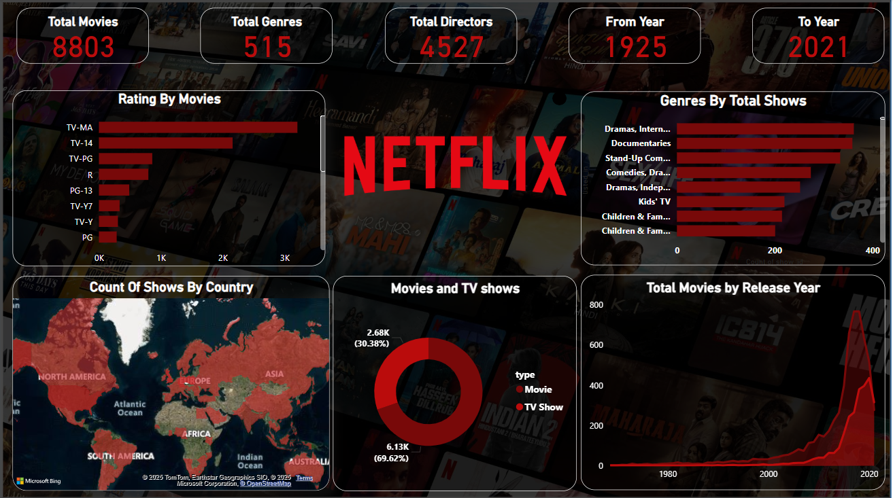

# 📊 Netflix Data Insights Dashboard

## 🔍 Overview
This Power BI dashboard provides comprehensive visual insights into Netflix’s movie and TV show dataset. It enables data exploration by content rating, genres, release years, countries, and content type (movie vs. TV show).

---

## 📁 Dataset
- **Source**: [Netflix Titles Dataset on Kaggle](https://www.kaggle.com/datasets/shivamb/netflix-shows)
- **Total Titles Analyzed**: `8803`
- **Years Covered**: `1925 to 2021`
- **Format**: CSV (`netflix_titles.csv`)

---

## 📈 Key Visuals

| Visual Name                  | Description |
|-----------------------------|-------------|
| 🔢 **Total Stats Cards**     | Shows total count of movies, genres, directors, and range of years. |
| 🧾 **Rating by Movies**      | Horizontal bar chart displaying distribution of movie ratings. |
| 🌍 **Count of Shows by Country** | Map visual showing the global distribution of shows. |
| 🗃️ **Genres by Total Shows** | Top genres with the highest show counts. |
| 🎥 **Movie vs TV Show Ratio**| Donut chart showing the percentage split. |
| 📅 **Movies by Release Year**| Line chart showing trends in movie releases over time. |

---

## 🛠️ Tools & Technologies
- **Power BI Desktop**
- **Microsoft Bing Maps**
- **DAX** for calculated columns and measures
- **Custom Visuals** (if map access is enabled)

---

## 🎯 Insights Derived
- Most content is rated **TV-MA**
- Dominant genres include **Dramas, Documentaries, and Stand-Up Comedy**
- Major content production is from **USA, India, and UK**
- Sharp increase in movie production post-2010
- ~70% content is **Movies** while ~30% are **TV Shows**

---

## 📝 How to Use
1. Clone this repository
2. Open the `.pbix` file using Power BI Desktop
3. Replace or transform the dataset if needed via `Transform Data`
4. Refresh the visuals

---

## 📸 Dashboard Screenshot

---

## 👨‍💻 Author

**Kartik Yadav**  
B.Tech CSE | Data Enthusiast | Power BI Developer

---

## 📬 Contact
- 📧 Email: [Kartikyadav102003@example.com]
- 🔗 LinkedIn: [https://www.linkedin.com/in/kartik-yadav-91929a271?utm_source=share&utm_campaign=share_via&utm_content=profile&utm_medium=android_app]
- 🐱 GitHub: [https://github.com/kartikydv120]

---

## 📄 License
This project is licensed under the [MIT License](./LICENSE).
